# HiFate-bazi 生产环境架构图 (Mermaid 版本)

## 📊 双机部署架构图

```mermaid
graph TB
    subgraph "用户/客户端"
        User[用户/客户端]
    end
    
    subgraph "Node1 主节点"
        direction TB
        N1_IP[公网IP: 8.210.52.217<br/>内网IP: 172.18.121.222]
        N1_Nginx[Nginx<br/>负载均衡/反向代理<br/>端口: 80, 443]
        N1_Web[Web 服务<br/>FastAPI<br/>端口: 8001]
        N1_MySQL[(MySQL 主库<br/>数据库: hifate_bazi<br/>端口: 3306)]
        N1_Redis[(Redis 主库<br/>缓存服务<br/>端口: 6379)]
        
        subgraph "微服务集群 (gRPC)"
            N1_MS1[bazi-core<br/>9001]
            N1_MS2[bazi-fortune<br/>9002]
            N1_MS3[bazi-analyzer<br/>9003]
            N1_MS4[bazi-rule<br/>9004]
            N1_MS5[fortune-analysis<br/>9005]
            N1_MS6[payment-service<br/>9006]
            N1_MS7[fortune-rule<br/>9007]
            N1_MS8[intent-service<br/>9008]
            N1_MS9[prompt-optimizer<br/>9009]
            N1_MS10[desk-fengshui<br/>9010]
        end
    end
    
    subgraph "Node2 从节点"
        direction TB
        N2_IP[公网IP: 47.243.160.43<br/>内网IP: 172.18.121.223]
        N2_Nginx[Nginx<br/>负载均衡/反向代理<br/>端口: 80, 443]
        N2_Web[Web 服务<br/>FastAPI<br/>端口: 8001]
        N2_MySQL[(MySQL 从库<br/>只读模式<br/>端口: 3306)]
        N2_Redis[(Redis 从库<br/>缓存服务<br/>端口: 6379)]
        
        subgraph "微服务集群 (gRPC)"
            N2_MS1[bazi-core<br/>9001]
            N2_MS2[bazi-fortune<br/>9002]
            N2_MS3[bazi-analyzer<br/>9003]
            N2_MS4[bazi-rule<br/>9004]
            N2_MS5[fortune-analysis<br/>9005]
            N2_MS6[payment-service<br/>9006]
            N2_MS7[fortune-rule<br/>9007]
            N2_MS8[intent-service<br/>9008]
            N2_MS9[prompt-optimizer<br/>9009]
            N2_MS10[desk-fengshui<br/>9010]
        end
    end
    
    %% 用户请求
    User -->|HTTP/HTTPS| N1_Nginx
    User -->|HTTP/HTTPS| N2_Nginx
    
    %% Nginx 负载均衡
    N1_Nginx -->|负载均衡| N1_Web
    N1_Nginx -.->|负载均衡| N2_Web
    N2_Nginx -.->|负载均衡| N1_Web
    N2_Nginx -->|负载均衡| N2_Web
    N1_Nginx <-->|故障转移| N2_Nginx
    
    %% Web 服务连接数据库
    N1_Web -->|读写| N1_MySQL
    N1_Web -->|读写| N1_Redis
    N2_Web -.->|只读| N1_MySQL
    N2_Web -->|只读| N2_MySQL
    N2_Web -.->|只读| N1_Redis
    N2_Web -->|只读| N2_Redis
    
    %% Web 服务连接微服务
    N1_Web -->|gRPC| N1_MS1
    N1_Web -->|gRPC| N1_MS2
    N1_Web -->|gRPC| N1_MS3
    N1_Web -->|gRPC| N1_MS4
    N1_Web -->|gRPC| N1_MS5
    N1_Web -->|gRPC| N1_MS6
    N1_Web -->|gRPC| N1_MS7
    N1_Web -->|gRPC| N1_MS8
    N1_Web -->|gRPC| N1_MS9
    N1_Web -->|gRPC| N1_MS10
    
    N2_Web -->|gRPC| N2_MS1
    N2_Web -->|gRPC| N2_MS2
    N2_Web -->|gRPC| N2_MS3
    N2_Web -->|gRPC| N2_MS4
    N2_Web -->|gRPC| N2_MS5
    N2_Web -->|gRPC| N2_MS6
    N2_Web -->|gRPC| N2_MS7
    N2_Web -->|gRPC| N2_MS8
    N2_Web -->|gRPC| N2_MS9
    N2_Web -->|gRPC| N2_MS10
    
    %% 主从复制
    N1_MySQL -.->|MySQL 主从复制<br/>GTID 模式| N2_MySQL
    N1_Redis -.->|Redis 主从复制| N2_Redis
    
    %% 样式
    classDef nginxStyle fill:#FFF2CC,stroke:#D6B656,stroke-width:2px
    classDef webStyle fill:#D5E8D4,stroke:#82B366,stroke-width:2px
    classDef mysqlStyle fill:#F8CECC,stroke:#B85450,stroke-width:2px
    classDef redisStyle fill:#E1D5E7,stroke:#9673A6,stroke-width:2px
    classDef msStyle fill:#D5E8D4,stroke:#82B366,stroke-width:1px
    
    class N1_Nginx,N2_Nginx nginxStyle
    class N1_Web,N2_Web webStyle
    class N1_MySQL,N2_MySQL mysqlStyle
    class N1_Redis,N2_Redis redisStyle
    class N1_MS1,N1_MS2,N1_MS3,N1_MS4,N1_MS5,N1_MS6,N1_MS7,N1_MS8,N1_MS9,N1_MS10,N2_MS1,N2_MS2,N2_MS3,N2_MS4,N2_MS5,N2_MS6,N2_MS7,N2_MS8,N2_MS9,N2_MS10 msStyle
```

---

## 📋 架构说明

### 服务器信息

| 节点 | 公网IP | 内网IP | 角色 | 状态 |
|------|--------|--------|------|------|
| Node1 | 8.210.52.217 | 172.18.121.222 | 主节点（MySQL主/Redis主） | ✅ 运行中 |
| Node2 | 47.243.160.43 | 172.18.121.223 | 从节点（MySQL从/Redis从） | ✅ 运行中 |

### 服务端口清单

| 服务 | 端口 | 说明 |
|------|------|------|
| Nginx | 80, 443 | 负载均衡和反向代理 |
| Web 服务 | 8001 | FastAPI 主服务 |
| bazi-core | 9001 | 八字核心计算服务 |
| bazi-fortune | 9002 | 运势计算服务 |
| bazi-analyzer | 9003 | 八字分析服务 |
| bazi-rule | 9004 | 规则匹配服务 |
| fortune-analysis | 9005 | 运势分析服务 |
| payment-service | 9006 | 支付服务 |
| fortune-rule | 9007 | 运势规则服务 |
| intent-service | 9008 | 意图识别服务 |
| prompt-optimizer | 9009 | 提示优化服务 |
| desk-fengshui | 9010 | 办公桌风水分析服务 |
| MySQL | 3306 | 数据库 |
| Redis | 6379 | 缓存 |

### 关键配置

- **负载均衡**：轮询算法，max_fails=3, fail_timeout=30s
- **MySQL 主从**：GTID 模式，用户 repl@%
- **Redis 主从**：自动同步
- **内网通信**：使用内网 IP (172.18.121.222/223)
- **故障转移**：自动检测并切换节点

### 访问地址

- **Node1**: http://8.210.52.217
- **Node2**: http://47.243.160.43
- **健康检查**: /health
- **API 文档**: /docs

---

## 🔍 连接说明

- **实线** (`-->`)**: 直接连接
- **虚线** (`-.->`): 跨节点连接或备用连接
- **双向箭头** (`<-->`): 双向通信

---

## 📚 相关文档

- **Draw.io 详细架构图**：`docs/architecture/HiFate-bazi-生产环境架构图.drawio`
- **架构图使用说明**：`docs/architecture/架构图使用说明.md`
- **生产环境架构和部署规范**：`docs/root_docs/生产环境架构和部署规范.md`

---

**最后更新**：2025-01-21

