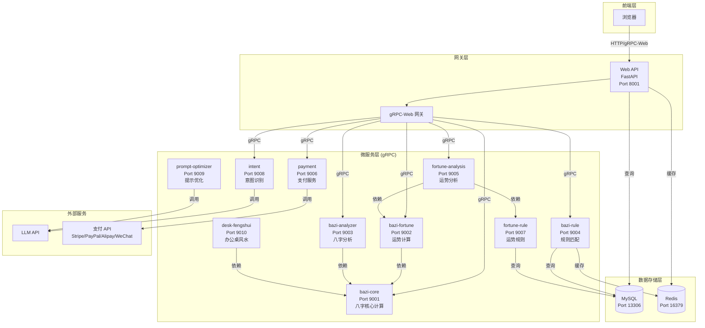
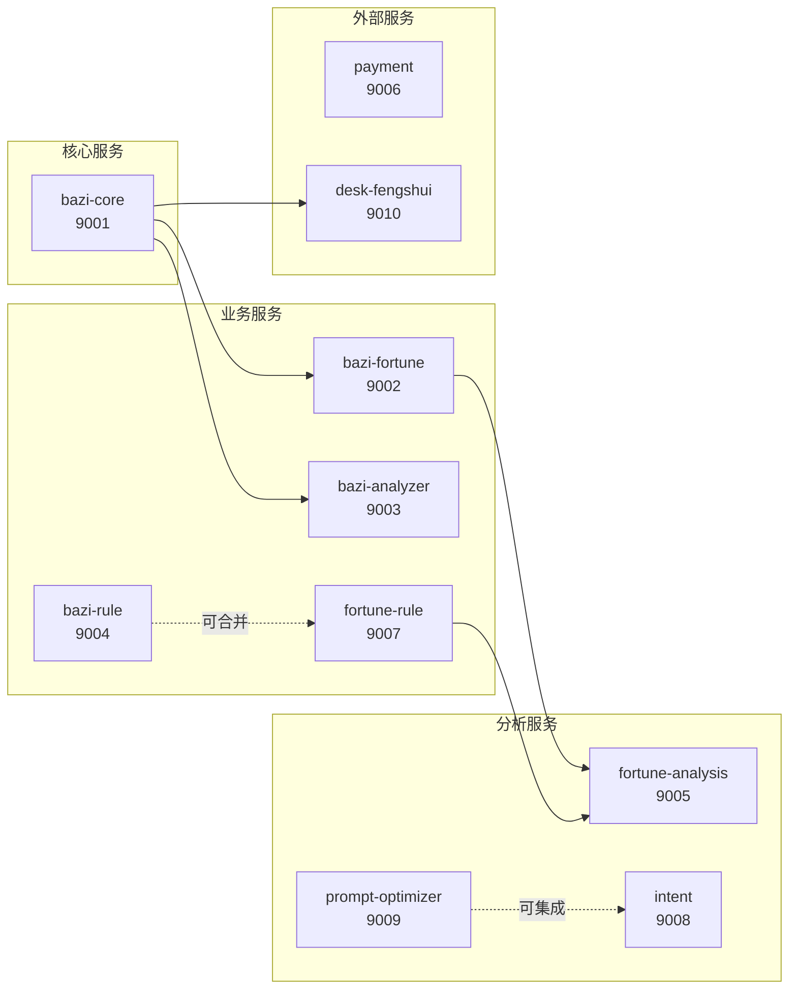
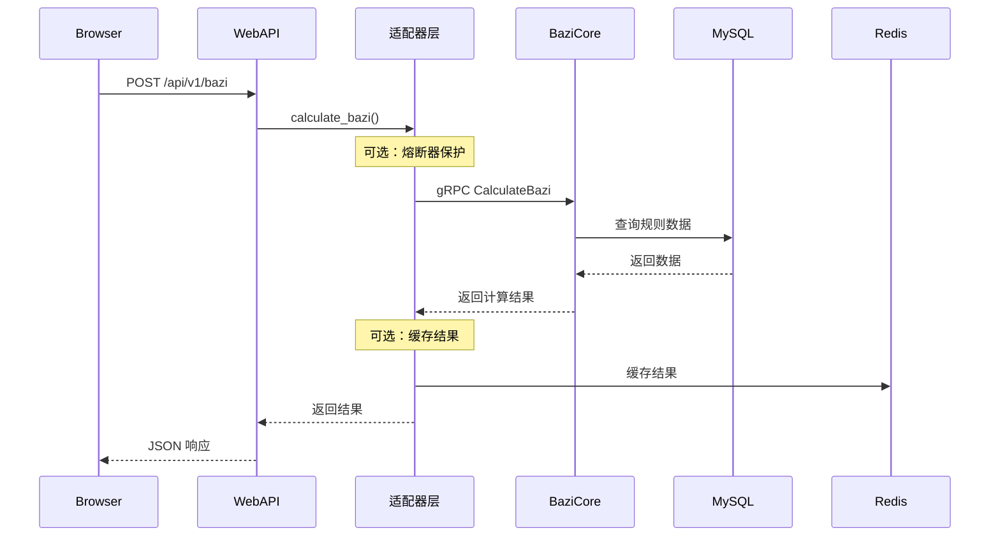
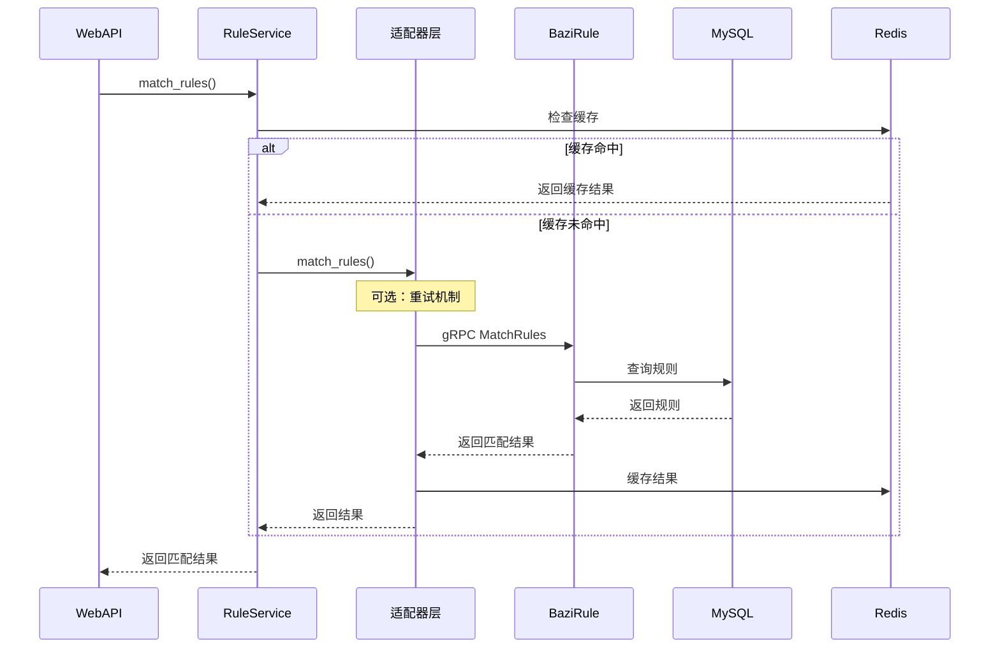
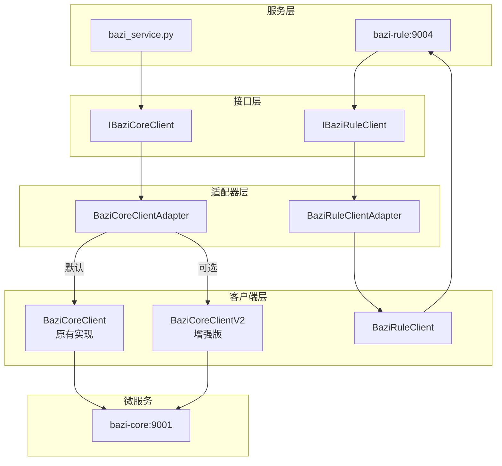
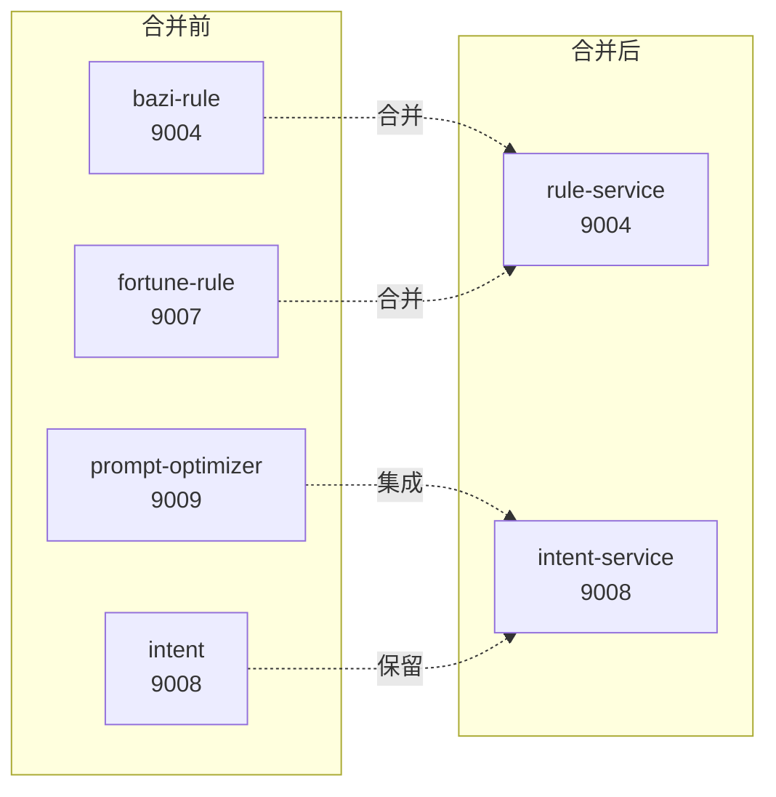
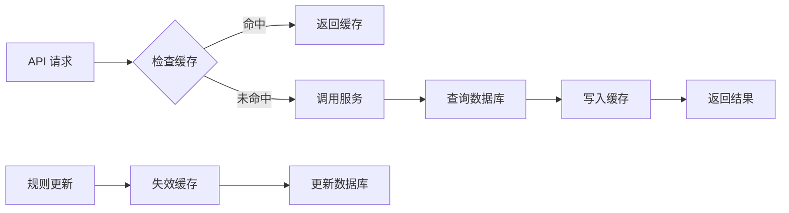

# HiFate-bazi 服务架构图

> **生成日期**: 2026-01-13  
> **版本**: v1.0

---

## 系统整体架构

---

## 服务依赖关系

---

## 服务调用链路示例

### 八字计算流程

### 规则匹配流程

---

## 接口-适配器架构

**关键优势**：
- 适配器层可以安全地添加熔断、重试、监控等功能
- 对上层服务完全透明
- 可以逐步迁移到新客户端

---

## 优化建议可视化

### 服务合并建议

**注意**：服务合并属于高风险操作，建议在有测试环境后再实施。

---

## 数据流图

### 缓存数据流

---

## 端口清单

| 服务 | 端口 | 协议 | 说明 |
|------|------|------|------|
| **Web API** | 8001 | HTTP/gRPC-Web | 主服务，对外提供 API |
| **bazi-core** | 9001 | gRPC | 八字核心计算服务 |
| **bazi-fortune** | 9002 | gRPC | 大运流年计算服务 |
| **bazi-analyzer** | 9003 | gRPC | 八字分析服务 |
| **bazi-rule** | 9004 | gRPC | 规则匹配服务 |
| **fortune-analysis** | 9005 | gRPC | 运势分析服务 |
| **payment** | 9006 | gRPC | 支付服务 |
| **fortune-rule** | 9007 | gRPC | 运势规则服务 |
| **intent** | 9008 | gRPC | 意图识别服务 |
| **prompt-optimizer** | 9009 | gRPC | 提示优化服务 |
| **desk-fengshui** | 9010 | gRPC | 办公桌风水服务 |
| **MySQL** | 13306 | TCP | 数据库 |
| **Redis** | 16379 | TCP | 缓存 |

---

**最后更新**: 2026-01-13  
**维护者**: HiFate Team
